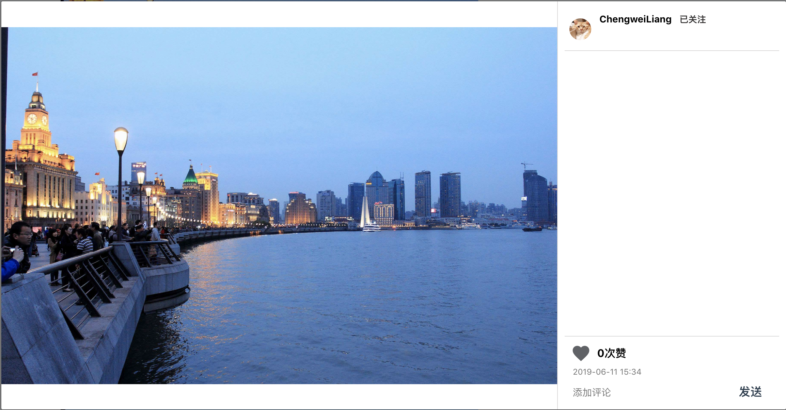

# README

## 项目介绍

Lucere是一个以照片分享为核心的社交平台。用户可以在上面分享照片，结交好友，进行评论、点赞等好友互动。同时用户还可以在网站发现自己喜欢的内容。

## 技术栈

前端：Vue.js，使用了Element-ui和iView组件

后端：Node.js + MySQL 

服务器部署：Nginx + pm2

## 项目运行

### 线上地址

lucere.cn （已过期）

### 线下运行

以下两种方式选一种即可：

**node运行方式**：通过命令行进入项目文件夹下，运行`npm install`安装依赖模块，再运行命令`node app.js`。在浏览器中键入 `localhost:3000`即可。

**node+vue运行方式**：在**node运行的基础上**再在命令行输入`npm run dev`启动vue服务器，此时在浏览器键入`localhost:8080`（vue默认端口）也可运行。这种运行方式不需要项目文件夹下的dist文件夹（vue build生成的静态文件）。

如果还是提示某些模块没有安装，通过`npm install 模块名`逐一安装相应模块即可。

### 测试账号

1. Account: ChengweiLiang

   Password: onceupontime

2. Account: LiYaKang

   Password: 123456

(推荐使用测试账号，注册新账号信息是空的)

注：我的数据库是放在腾讯云服务器，但之前因为黑客攻击数据被清空了两次，因此我现在会定时备份数据和检查数据库有没有被攻击。如果有发现数据异常的情况请联系我。

## 代码说明

app.js: node.js程序入口

controller, service: node后端逻辑

src: vue前端代码，页面在其内view文件夹下

dist: vue build出的静态文件

build, config：vue配置文件

## 网站主要功能与工作量

### 登录注册页面

登录注册页面实现了基本的功能，其中包括了一些必要的检查。对于注册页面，能够**动态检查账户名(唯一的)是否已经被注册**，**动态检查两次输入密码是否一致**。**只有当以上检查都通过后按钮才可以点击**：

登录页面同样也是必须将所有项都填入后才能点击按钮。点击按钮后，会检查输入账号和密码是否正确：

### 主页

进入主页后，在本页下可查看到所有好友发送的动态。在右侧为用户推荐了一些好友，包括**关注自己但自己没有关注的粉丝**，可以通过点击查看他们的信息或者点击**"加号"**关注他们。同时右边还显示了**好友动态**，显示了自己关注的用户的一些消息。同样也可以通过**点击这些消息**来查看具体的用户和动态信息：

在菜单栏上有一个**"爱心"**按钮，这个按钮表示消息，**如果有红点则表示当前有未读的消息**。对于每个消息，可以**点击其查看其详情**，点击旁边的**"叉号"**来清除这个消息，或者是直接点击下方的**全部已读**来清楚所有消息：

当没有新消息时，会显示**"当前无新消息"**，同样小红点提醒也会**消失**：

每条动态以卡片的形式展示。如果有多张图片，下面会有**走马灯**的按钮进行切换图片。

下方一栏是一些互动选项，点击**"爱心"**图标可以点赞，同时可以**输入评论**进行发送，下方栏本身会挑选**两条最新评论**进行展示：

点击**"聊天气泡"**图标或者是点击**"全部评论"**，可以弹出**动态详情**。动态详情里包括**动态图片大图**(同样多张通过走马灯切换)，所有评论。同样也可以在本页面下进行评论、点赞等活动。如果是非自己发布的动态，在发布用户名旁边会有一个**关注/已关注按钮**，点击其可以快捷进行关注/取关。同时，该动态详情卡片**在其他页面**选择查看详情时也可以显现出来：

对于本项目，**图片如何展示**是一个关键点。主页下的动态卡片，其**图片框宽度是一定**的，高度根据图片而定。对于动态详情，其图片的框是一个**固定大小的框**，图片要对其进行适配。在主页下，如果一个动态只有**一张图片很好解决**，直接将其宽度定为图片框的宽度，高度自适应即可。但对于多张图片，其适配方式就会有些不同。

因此，这里我提供了**两种图片的展现方式**。（**无论哪种方式在主页下的动态卡片中都是会展示全图**）一种是**切割方式**，切割方式在于无论在哪里展示动态都**不会出现空白处**，它会根据图片框的大小自动切割图片的**中间部分**，进行展示。另一种是**缩放模式**，缩放模式下每个图片都能**展示其全貌**，但会根据图片框大小调整其位置，会在图片框中**留下空白处**，图片会有一种"拍立得"的风格。

举例子，主页下的一条动态有两张大小格式不同的图片，切割方式下其展现为：

缩放方式下第二张展现为：

同样，对于其他地方展示的图片也会有这样的规律，如下：

点击菜单栏的**"上传"**图标，即可发表动态。可以选择上传的图片(**最多五张**)，输入内容，输入话题(**每个话题以#开头**，空格分割)，选择图片的展现方式，点击"确定"进行发送：

点击图片缩略图可进行查看大图和删除：

点击发送后，程序会对上传图片**进行压缩**，如图从console输出看出将一个图片从14M压缩至434K：

最后，在主页的菜单栏有搜索框，可以输入名称**搜索用户与话题**。点击其可进入其相应页面：

### 个人信息页面

在任何页面下，**点击用户名**都可以进入个人信息页面(点击主页菜单栏的"人像"按钮可以进入自己的个人页面)。该页面下会显示用户发送的动态、粉丝/关注数、动态数、个人信息等。用户可以在这个页面下点击"关注/已关注"按钮来切换关注状态（**如果使自己，该按钮会变成一个"设置"图标**）：

点击粉丝/正在关注的数量可以查看该**用户的粉丝/关注列表**：

在本人的页面下，点击**"设置"图标**，可以修改个人信息，但**个人账号是无法修改**的。同样可以在该栏目下点击**"退出登录"**来退出登录：

同时，如果是本人页面，可以点击头像图标来**上传新头像**：

页面下方是该用户所发的动态。在往下浏览的过程中当页面**下滑到一定位置**(掩盖上面部分的个人信息)时，页面上方会出现一行**个人信息横栏**。（**同样可以直接点击个人信息的"动态数"直接切换到这个位置**）当鼠标移到某一个动态的封面上时，**封面会变灰并显示动态的评论数和点赞数**，点击后可以弹出动态详情。这些封面都是取动态的**第一张图的中间位置**而成的：

### 话题页面

话题页面的进入方式有两种，一是**点击动态内容中的#话题**，二是**直接通过搜索进入**。对于一条动态可以给其关联相关的话题(以#开头)，这样这个动态就可以通过搜索这个话题来找到，即**在该话题页面下能找到该动态**。

话题页面如下所示，用户可以**关注该话题**，选择**"最新"和"热门"**两种排序方式。动态通过**小卡片瀑布流**的形式展现，用户同样可以进行查看详情、点赞、评论等操作：

### 发现页面

每个用户可以点击在菜单栏的**"地球"**图标进入发现页面。发现页面与**自己关注的话题**有关，会将**自己关注的所有的话题的所有动态按照时间**展示：

上半部分是选择的动态详情，页面背景图片是选择查看的动态的封面图(对其进行了高斯模糊和变暗处理)。如果该动态有多张图片，将鼠标移到大图上时会弹出图片选择栏，点击可以切换图片：

下方的卷轴是动态列表，**本身其亮度很低**，只有当鼠标移到其之上时才会变亮一些。而将鼠标移到某一具体项上时**图片会放大并变灰**，点击可以切换查看的动态，卷轴两侧的"箭头"图标是分页：

